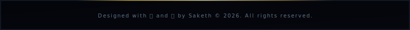

  

  

  

---

## 🙋‍♂️ About Me

I am a B.Tech Computer Science Engineering student specializing in **Artificial Intelligence &amp; Machine Learning**. My academic work centers on leveraging deep learning algorithms, computer vision, and NLP frameworks to build intelligent, scalable systems.

*   🔭 **Current Role:** CS Student &amp; Aspiring AI Engineer
*   🎓 **Field of Study:** B.Tech in CSE (Artificial Intelligence &amp; Machine Learning)
*   🌱 **Currently Learning:** Large Language Models (LLMs), Retrieval-Augmented Generation (RAG), Deep Learning, and Open Source Contributions
*   🤝 **Looking to Collaborate On:** Open-source AI tools and machine learning applications
*   ⚡ **Fun Fact:** The term "weights" in neural networks is inspired by synaptic weights in human brains!

---

## 🛠️ Tech Stack

<b>Click to expand/collapse Tech Stack</b>

 

<table align="center" border="0" cellpadding="5" cellspacing="0" width="100%">
  <tr>
    <td align="right" width="20%"><b>Languages:</b></td>
    <td>
      
      
      
      
      
      
    </td>
  </tr>
  <tr>
    <td align="right"><b>Frontend:</b></td>
    <td>
      
    </td>
  </tr>
  <tr>
    <td align="right"><b>Backend:</b></td>
    <td>
      
      
    </td>
  </tr>
  <tr>
    <td align="right"><b>Databases:</b></td>
    <td>
      
      
      
    </td>
  </tr>
  <tr>
    <td align="right"><b>AI &amp; ML:</b></td>
    <td>
      
      
      
      
      
      
      
    </td>
  </tr>
  <tr>
    <td align="right"><b>Tools:</b></td>
    <td>
      
      
      
      
    </td>
  </tr>
</table>

---

## 📊 GitHub Statistics

  

  

---

## 💼 Experience

<b>Click to expand/collapse Experience Timeline</b>

 

| Organization/Project | Role | Duration | Key Contribution |
| :--- | :--- | :--- | :--- |
| Autism Prediction | ML Developer | 2026 | Built ASD screening classifiers using Scikit-Learn. |
| QFlow Queue System | Full Stack Developer | 2026 | Devised real-time wait-time syncing using React and Supabase. |
| Electricity Theft Detection | ML Developer | 2026 | Developed CNN-LSTM neural networks to parse smart meter grids. |

---

## 📄 Resume

  

---

## 🌐 Connect With Me

  
  
  
  

---

  

