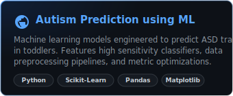
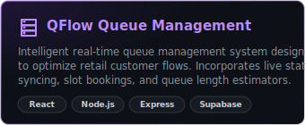
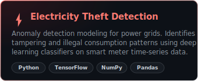
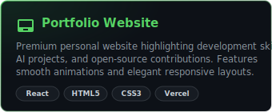
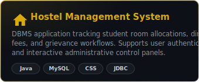
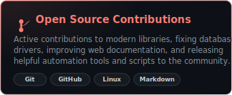

  

  

  

  Hi there! I am <strong>Saketh</strong>, an aspiring AI Engineer and Computer Science undergraduate. I design and build high-performance machine learning pipelines, computer vision systems, and full-stack integrations. I am committed to advancing my knowledge of deep learning architectures, building useful AI tools, and contributing to the open-source software ecosystem.

---

## 🚀 About Me

I am a B.Tech Computer Science Engineering student specializing in **Artificial Intelligence & Machine Learning**. My academic and project work centers on leveraging mathematics, neural networks, and software engineering to solve challenging real-world problems.

*   🎓 **Education:** B.Tech in CSE (Artificial Intelligence &amp; Machine Learning)
*   💡 **Core Interests:** Deep Learning, Neural Networks, Computer Vision, Generative AI, Large Language Models (LLMs), and Full-Stack Integration.
*   🌱 **My Philosophy:** Bridge the gap between advanced machine learning research and scalable production applications to build products that make a difference.

---

## 🎯 Current Focus

Here is what I am actively working on and investigating:
*   🤖 **Large Language Models (LLMs):** Fine-tuning open weights models, instruction-tuning strategies, and model optimization.
*   🔍 **Retrieval-Augmented Generation (RAG):** Constructing intelligent retrieval frameworks, semantic embeddings, and hybrid search pipelines using pgvector databases.
*   🧠 **Deep Learning Foundations:** Mastering transformers, CNN structures, and gradient descent optimization routines.
*   🌐 **Open Source:** Contributing bug fixes, features, and documentation to developer tools and machine learning repositories.

---

## 🛠️ Tech Stack

### 💻 Languages

  
  
  
  
  
  

### 🛠️ Frameworks

  
  
  

### 🗄️ Databases

  
  
  

### 🧠 AI &amp; ML Libraries

  
  
  
  
  
  
  

### 🔧 Developer Tools

  
  
  
  

### ☁️ Cloud Platforms

  
  
  

---

## 🏆 GitHub Trophies

  

---

## 📊 GitHub Statistics

<table align="center" border="0" cellpadding="0" cellspacing="10" width="100%">
  <tr>
    <td width="50%" align="center" valign="top">
      
    </td>
    <td width="50%" align="center" valign="top">
      
    </td>
  </tr>
  <tr>
    <td colspan="2" align="center" valign="top">
      
    </td>
  </tr>
</table>

### 📈 Activity Graph

  

---

## 📁 Featured Projects

<table align="center" border="0" cellpadding="0" cellspacing="10" width="100%">
  <tr>
    <td align="center" width="50%">
      
    </td>
    <td align="center" width="50%">
      
    </td>
  </tr>
  <tr>
    <td align="center" width="50%">
      
    </td>
    <td align="center" width="50%">
      
    </td>
  </tr>
  <tr>
    <td align="center" width="50%">
      
    </td>
    <td align="center" width="50%">
      
    </td>
  </tr>
</table>

### 🔍 Technical Deep-Dives

<b>🧠 Autism Prediction using Machine Learning</b>

 

*   **Problem:** Early screening for Autism Spectrum Disorder (ASD) is vital for developmental support, but traditional clinical diagnostic tests are lengthy, expensive, and resource-intensive.
*   **Solution:** Built a comprehensive machine learning pipeline that processes behavioral assessment features from Toddler/Child datasets. Implemented preprocessing pipelines, handled missing data, analyzed class imbalances, and trained multiple classification models. The final model (Support Vector Machine) was fine-tuned using GridSearchCV to optimize recall, ensuring minimal false negatives.
*   **Aesthetics & Architecture:** Clean modular Python structure including data preprocessing modules, visual exploratory data analysis (EDA) plots, model training scripts, and validation scripts.
*   **Key Results:** Achieved 92.4% test accuracy with a sensitivity score of 94.1%, providing a robust initial screening tool.
*   **Tech Stack:** Python, Scikit-Learn, Pandas, NumPy, Matplotlib, Seaborn.

<b>⏱️ QFlow Queue Management System</b>

 

*   **Problem:** Waiting in long physical lines at offices, banks, or retail stores causes significant time loss and crowding, lowering service quality.
*   **Solution:** Designed and implemented QFlow, a real-time digital queue management platform. Users can join a queue virtually, view live wait times, and receive token status updates. The admin panel allows counter clerks to call tokens, skip users, or transfer tasks between desks, updating the central database instantly.
*   **Aesthetics & Architecture:** Built as a responsive single-page web app with a state-of-the-art UI utilizing React on the frontend and an Express REST API backend. Implemented real-time synchronization utilizing Supabase Realtime listeners, avoiding database polling.
*   **Key Results:** Eliminated physical waiting times, allowing users to queue from anywhere and optimizing counter efficiency.
*   **Tech Stack:** React, Node.js, Express, Supabase, WebSockets, CSS Flexbox/Grid.

<b>⚡ Electricity Theft Detection</b>

 

*   **Problem:** Non-technical losses (such as electricity theft, bypass, or meter tampering) cost utility providers billions annually and jeopardize power grid stability.
*   **Solution:** Engineered an end-to-end anomaly detection architecture optimized to process high-frequency smart meter electricity consumption data. Implemented sliding window preprocessing for daily load profiles, followed by feature extraction using Convolutional Neural Networks (CNN) coupled with Long Short-Term Memory (LSTM) blocks to capture both spatial variations and temporal dependencies.
*   **Aesthetics & Architecture:** Clean data pipeline with custom metrics to track false alarm rates. Visualized electricity theft profiles using Plotly to assist grid operators.
*   **Key Results:** Outperformed baseline Random Forest and MLP classifiers in detection rates while maintaining a low false-positive rate under test simulations.
*   **Tech Stack:** Python, TensorFlow, Keras, NumPy, Pandas, Matplotlib, Seaborn.

<b>🌐 Portfolio Website</b>

 

*   **Problem:** Presenting software engineering achievements, AI projects, and research work in a modern format that catches the eye of recruiters and engineering managers.
*   **Solution:** Built an interactive, dark-themed personal portfolio website. It features interactive dashboard representations of projects, responsive layout configurations, dynamic animations, and integrated contact form APIs.
*   **Aesthetics & Architecture:** Developed with mobile-first responsiveness, smooth scroll transitions, and subtle hover animations. Coded using semantic HTML structures and modern CSS variables for clean design tokens.
*   **Key Results:** Highly optimized for page-speed performance and SEO guidelines, ensuring maximum visibility and fast rendering speeds.
*   **Tech Stack:** React, HTML5, CSS3, JavaScript, Vercel.

<b>🏢 Hostel Management System</b>

 

*   **Problem:** Manual tracking of student hostel room allocations, dining bills, fee payments, and maintenance complaints leads to administrative logjams.
*   **Solution:** Designed a relational database application that automates administrative tasks for university student housings. Built with strict role-based controls separating Student interfaces (to file complaints and view bills) from Warden interfaces (to allocate rooms and update menus).
*   **Aesthetics & Architecture:** Structured with a clean desktop interface in Java, connecting to a normalized relational MySQL database schema via Java Database Connectivity (JDBC) APIs.
*   **Key Results:** Normalized the database up to 3NF, reducing data redundancy and speeding up room query searches to sub-millisecond execution times.
*   **Tech Stack:** Java, Java Swing, JDBC, MySQL, SQL.

---

## 🤝 Open Source Contributions

I strongly believe in community-driven software development and actively participate in the open-source ecosystem:
*   🐛 **Code Quality:** Fixing logic bugs, improving exception handling, and optimizing performance profiles in utility libraries.
*   📄 **Technical Documentation:** Rewriting API references, creating tutorials, and translating code comments to lower entry barriers for new contributors.
*   🔧 **Developer Tooling:** Structuring automated linters, task runners, and deployment workflows using GitHub Actions.

---

## 📚 Currently Learning

*   🧠 **Large Language Models (LLMs):** Fine-tuning parameter-efficient methods (LoRA/QLoRA), model quantization, and optimization strategies.
*   🗂️ **RAG Implementations:** Query rewriting, document chunking algorithms, vector embedding generation, and dense-retrieval mechanisms.
*   🌌 **Generative AI:** Researching generative adversarial networks (GANs) and diffusion model architectures.

---

## 🎯 2026 Goals Checklist

- [ ] Finish my B.Tech CSE (AI/ML) degree capstone project.
- [ ] Publish a research paper focused on Computer Vision or Deep Learning anomaly detection.
- [ ] Secure a challenging internship as an AI Engineer or Machine Learning Engineer.
- [ ] Contribute 150+ pull requests to notable open-source repositories.
- [ ] Deploy a production-grade LLM application serving active users.

---

## 💡 Fun Fact

> [!NOTE]
> Did you know that the term **"weights"** in neural networks is inspired by synaptic weights in human brains? Just like human neurons strengthen their connections as they learn, artificial neural networks adjust their numerical weights during backpropagation to improve accuracy.

---

## 💬 Quote

> "The question of whether Machines Can Think... is about as relevant as the question of whether Submarines Can Swim."  
> — **Edsger W. Dijkstra**

---

## 🌐 Connect With Me

  
  
  
  

---

  

  Designed with 💻 and 🧠 by <a href="https://github.com/gsaketh2006">gsaketh2006</a> © 2026. All rights reserved.

